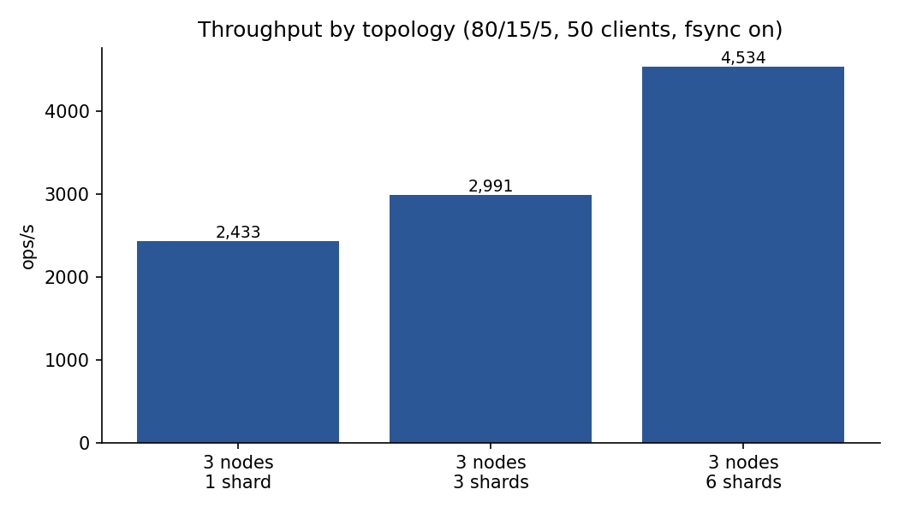
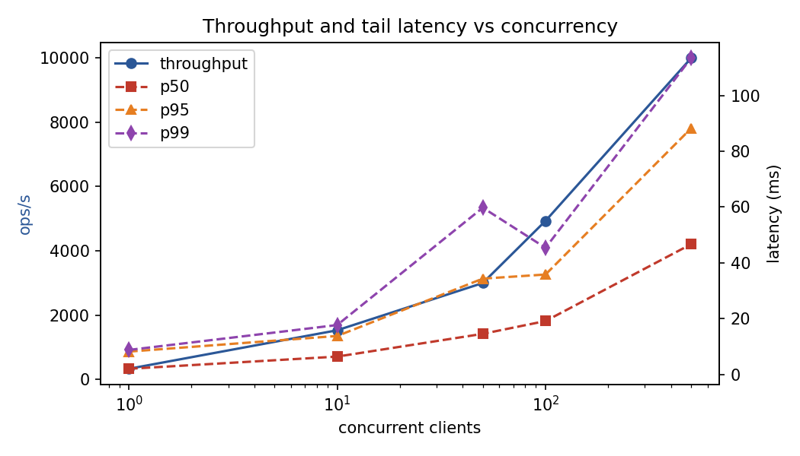
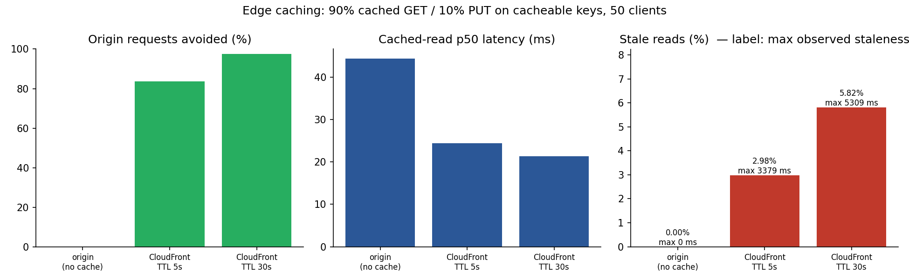

# Experiments

All numbers below were measured with `bench/run-local.sh` on one Apple Silicon Mac (10 cores). The three nodes run as processes on the same machine and share one SSD. Raw results: `bench/results/local.jsonl`; charts: `docs/charts/`; full table: `docs/charts/summary.md`.

One property of this environment dominates every write-path number: **macOS `F_FULLFSYNC` costs ~11 ms regardless of size** (microbenchmark: one 600 B record 10.6 ms; a 60 KB batch of 100 records also 10.6 ms). On EC2 with EBS gp3 an fsync is ~1 ms, so the AWS numbers will differ substantially; they are the first thing to re-measure after deploying.

## Method

`edgekv-bench` is a closed-loop generator: each client goroutine sends one request, waits, records the latency, repeats. Throughput is therefore concurrency divided by mean latency — the behaviour of a service with a fixed set of callers. Each run restarts the cluster with an empty data directory, preloads the key space, warms up for 2 s and measures for 10 s. Default workload: 80% GET / 15% PUT / 5% DELETE, 512 B values, 20,000 keys.

A **stale read** is a cached read that returned a version lower than one acknowledged by a write that completed *before the read started*.

## 1. Topology

 

| Topology | ops/s | PUT p50 | PUT p99 |
|---|---|---|---|
| 1 node, 1 shard (no replication) | 4,965 | 9.2 ms | — |
| 3 nodes, 1 shard | 1,521 | 31.8 ms | 70 ms |
| 3 nodes, 3 shards | 1,237 | 39.3 ms | 98 ms |
| 3 nodes, 6 shards | 1,331 | 37.3 ms | 110 ms |

Replication costs 3.3× in throughput: a write goes from one fsync to two serial fsyncs (leader, then follower) plus a network round trip. That is inherent to "acknowledged by a majority".

Sharding does **not** help on a single machine, and slightly hurts. All three processes share one SSD, so more shards means more Raft groups queueing for the same ~11 ms fsync. The bottleneck sharding removes — one disk per leader — does not exist here. On EC2, with one EBS volume per node and the three leaders spread across three machines, the fsyncs run in parallel; that is the expected scaling curve and remains to be measured.

## 2. The price of durability

| | Write throughput | PUT p50 | PUT p99 |
|---|---|---|---|
| fsync on (correct) | 798 ops/s | 60.6 ms | 112 ms |
| fsync off (unsafe) | 8,646 ops/s | 3.5 ms | 43 ms |

10.8× throughput, entirely fsync. Without fsync a power loss can drop acknowledged writes and even a persisted vote (allowing two leaders in one term), so `-fsync=false` exists only to measure this cost.

## 3. Concurrency and tail latency

| Clients | ops/s | p50 | p95 | p99 |
|---|---|---|---|---|
| 1 | 450 | 0.34 ms | 11 ms | 12 ms |
| 10 | 746 | 11.7 ms | 36 ms | 45 ms |
| 50 | 1,243 | 38.5 ms | 82 ms | 99 ms |
| 100 | 1,838 | 52.8 ms | 98 ms | 119 ms |
| 500 | 3,620 | 123 ms | 274 ms | 364 ms |

With one client the p50 is 0.34 ms — that is a GET (ReadIndex, one heartbeat round, no fsync); the p95 of 11 ms is a PUT. Throughput rises 8× from 1 to 500 clients while the number of fsyncs per second cannot: this is group commit, with more proposals sharing each flush as concurrency grows. The cost is latency growing roughly linearly with queue depth.

## 4. Uniform vs Zipf keys

| Distribution | ops/s | p50 | p99 |
|---|---|---|---|
| Uniform | 1,236 | 39.3 ms | 102 ms |
| Zipf (s = 1.1) | 1,230 | 39.5 ms | 101 ms |

No difference, as expected: every write in a shard is serialised through the Raft log regardless of key, so a hot key adds no contention beyond what already exists. Hot keys pay off in the cache experiments instead (higher hit ratio).

## 5. Edge caching: hit ratio, latency, staleness

Workload: 90% cached GET + 10% PUT on cacheable keys, 50 clients, through the local CloudFront-like edge (`cmd/edgekv-edge`).

| Configuration | Hit ratio | Cached-read p50 | Stale reads | Max staleness |
|---|---|---|---|---|
| Origin only (no cache) | 0% | 3.46 ms | 0 | 0 |
| TTL 5 s + invalidation | 80.4% | 0.22 ms | 0.04% | 49 ms |
| TTL 30 s + invalidation | 93.8% | 0.29 ms | 0.10% | 188 ms |
| TTL 60 s + invalidation | 92.8% | 0.38 ms | 0.08% | 49 ms |

Cached reads are 10–15× faster than origin reads and 80–94% of them never reach the origin. Raising the TTL from 5 s to 30 s lifts the hit ratio from 80% to 94%; 60 s adds nothing because the key set is already resident. Stale reads stay at or below 0.1% because invalidation takes effect within ~50 ms of a write.

## 6. Invalidation failure: does the contract still hold?

The edge was started with `-fail-invalidations`, so every invalidation request from the nodes was rejected (a CloudFront API outage). TTL = 5 s.

| | Hit ratio | Stale reads | Max staleness |
|---|---|---|---|
| Invalidation working | 80.4% | 0.04% | 49 ms |
| **Invalidation failing** | 74.9% | **2.28%** | **4,762 ms** |

The stale-read rate rose 57×, but the maximum observed staleness of 4,762 ms stayed **below the 5,000 ms TTL**. Invalidation is an optimisation; the TTL is the guarantee, and it held in the worst case.

## Failover

Measured by hand with `scripts/cluster.sh`: `kill -9` the leader of a shard while writing continuously — the first successful write landed **0.55 s** after the kill, consistent with the 300–600 ms election timeout plus one no-op commit.

## AWS results

Measured on the Terraform deployment in `deploy/terraform`: 3 × t3.small in us-west-2, one AZ each, one EBS gp3 (3000 IOPS) data volume per node, CloudFront in front. The load generator for experiments 1–3 ran inside the VPC on n1 (so it shares n1's 2 vCPUs — a small handicap for the cluster), because public-internet RTT would otherwise dominate closed-loop latency. Experiment 5 ran from a laptop in Los Angeles, through CloudFront, because that is the path real clients take. Raw data: `bench/results/aws.jsonl`; charts: `docs/charts/aws/`.

### 1. Topology — the sharding curve appears

| Topology (fsync on, 50 clients) | ops/s | p50 | p99 | Local (same test) |
|---|---|---|---|---|
| 3 nodes, 1 shard | 2,433 | 19.7 ms | 40 ms | 1,521 |
| 3 nodes, 3 shards | 2,991 | 14.0 ms | 72 ms | 1,237 |
| 3 nodes, 6 shards | **4,534** | **10.2 ms** | 34 ms | 1,331 |

On AWS, going from one shard to six raises throughput **1.9×** and halves the median latency. Locally the same change did nothing. The difference is exactly the precondition stated above: on EC2 each node has its own EBS volume and the leaders are spread across nodes (`n1` leads shards 0 and 3, `n2` 1 and 4, `n3` 2 and 5), so fsyncs on different shards proceed in parallel instead of queueing on one disk.

### 2. Durability

| 3 shards, 100% PUT, 50 clients | ops/s | p50 | p99 |
|---|---|---|---|
| fsync on | 2,298 | 19.8 ms | 53 ms |
| fsync off | 8,002 | 4.5 ms | 28 ms |

3.5× on AWS versus 10.8× locally. EBS gp3 acknowledges an fsync in roughly 1–2 ms where macOS `F_FULLFSYNC` takes ~11 ms, so durability is still the dominant cost of a write but no longer an order of magnitude.

### 3. Concurrency

| Clients | ops/s | p50 | p95 | p99 |
|---|---|---|---|---|
| 1 | 335 | 2.0 ms | 8.2 ms | 8.8 ms |
| 10 | 1,532 | 6.4 ms | 14 ms | 18 ms |
| 50 | 3,000 | 14.6 ms | 34 ms | 60 ms |
| 100 | 4,931 | 19.1 ms | 36 ms | 45 ms |
| 500 | **9,988** | 46.7 ms | 88 ms | 113 ms |

A single client sees 2 ms for a linearizable GET (one ReadIndex heartbeat round inside the VPC) and ~8 ms for a PUT (two fsyncs plus two round trips). Throughput climbs 30× to just under 10,000 ops/s at 500 clients while p99 stays at 113 ms — group commit works much better here than locally, because the per-flush cost it amortises is small enough that batches stay short.

### 5. CloudFront: hit ratio, latency, staleness

Workload: 90% cached GET + 10% PUT on cacheable keys, 20 clients, from Los Angeles; the cluster is in Oregon.

| | Hit ratio | Cached-read p50 | Stale reads | Max staleness | TTL |
|---|---|---|---|---|---|
| Origin only (LA → Oregon, linearizable) | 0% | 44.4 ms | 0 | 0 | — |
| CloudFront, TTL 5 s | 83.5% | 24.4 ms | 2.98% | 3,379 ms | 5,000 ms |
| CloudFront, TTL 30 s | 97.6% | 21.3 ms | 5.82% | 5,309 ms | 30,000 ms |

Two things differ from the local simulator, both as predicted. First, the latency win is 2× rather than 10×: a cached read still costs one round trip to the nearest CloudFront edge (~20 ms from this laptop), whereas the simulator was on localhost. Second, CloudFront takes **3–5 s to propagate an invalidation** to its edges (the simulator took none), so the stale-read rate rises from 0.1% to a few percent and the maximum observed staleness lands at 3.4–5.3 s. **It stayed under the TTL in both configurations**, which is the contract: invalidation makes the common case better, the TTL bounds the worst case.

The nodes issued the invalidations through their EC2 instance role (`edgekv_cdn_invalidations_total{result="ok"}` on each leader; `aws cloudfront list-invalidations` shows them all `Completed`).

### Failover on AWS

`docker kill` on the container leading shard 1, while writing continuously from another node: the first successful write landed **0.33 s** after the kill (0.55 s locally). After `docker start`, the node came back as a follower on all three shards and served the writes it had missed.

### Deployment problems worth recording

- CloudFront rejects `PUT/POST/DELETE` on a behaviour bound to an **origin group**; the default (write-capable) behaviour now targets a single origin, and only the GET-only `/v1/cache/*` behaviour uses the failover group.
- The security group allowed 8080 from CloudFront and the operator but not between nodes, so leader forwarding over the private network timed out. Added a `self` rule.
- The Go client sent `X-Edgekv-No-Forward` on every request. The local simulator strips it; CloudFront forwards viewer headers verbatim, so a non-leader origin answered 421 and the client counted an error. Cached reads through the CDN no longer send it.
