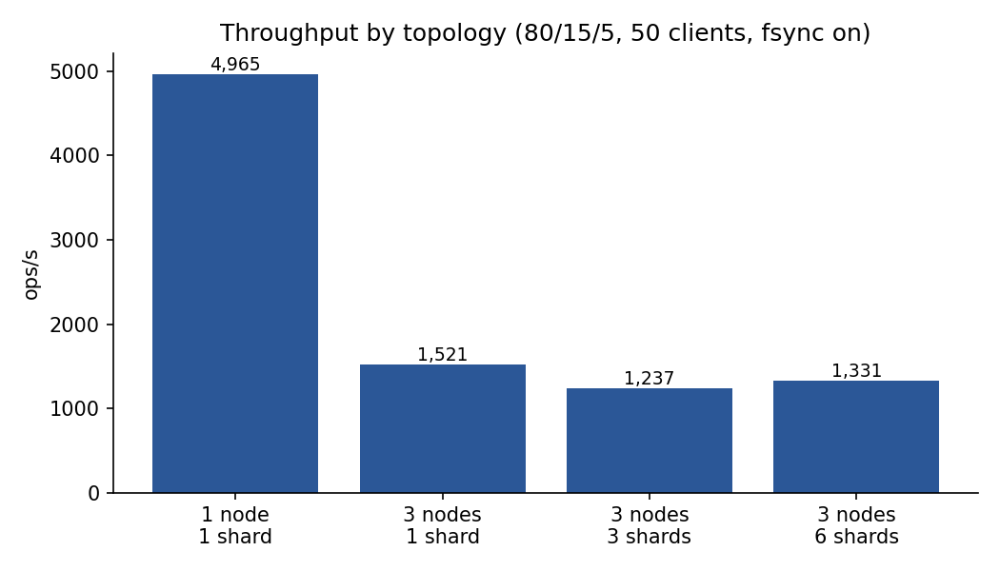
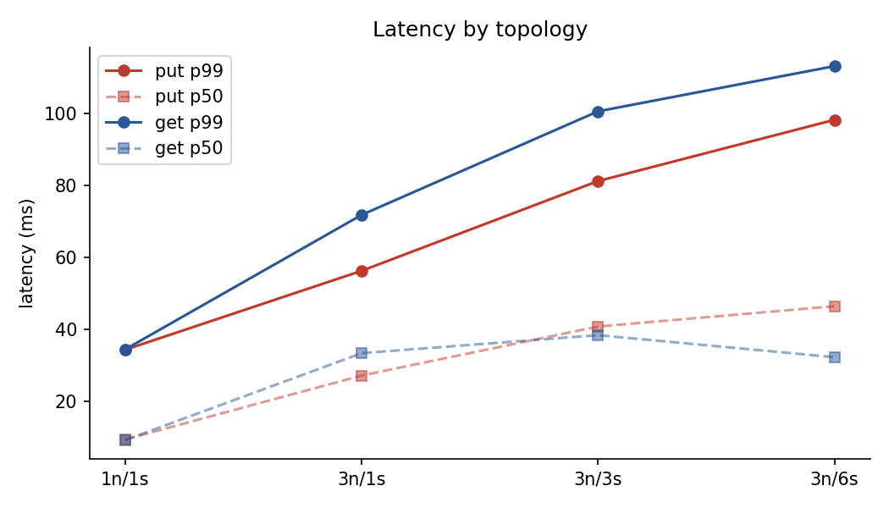
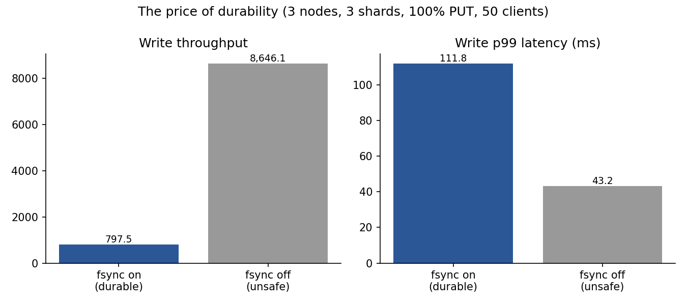
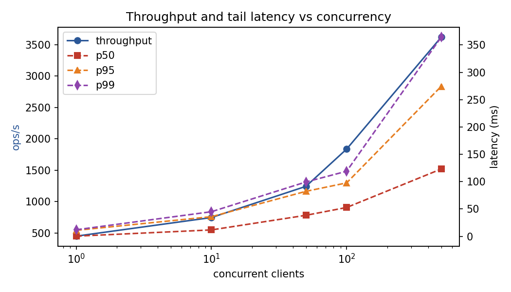
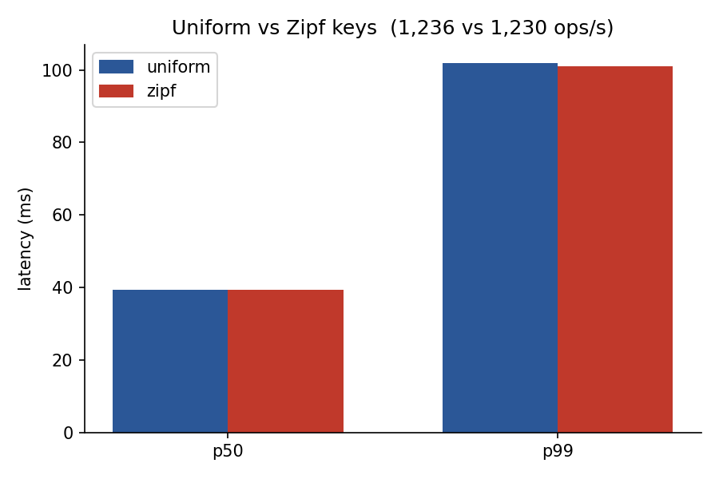
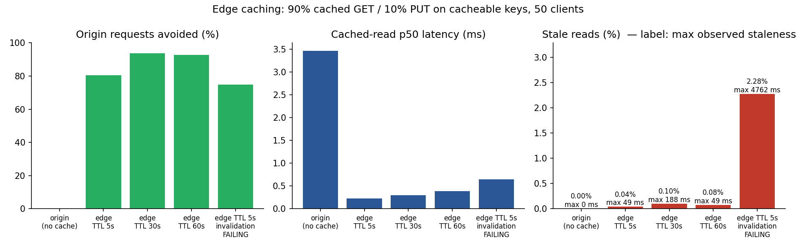

# Experiments

All numbers below were measured with `bench/run-local.sh` on one Apple Silicon Mac (10 cores). The three nodes run as processes on the same machine and share one SSD. Raw results: `bench/results/local.jsonl`; charts: `docs/charts/`; full table: `docs/charts/summary.md`.

One property of this environment dominates every write-path number: **macOS `F_FULLFSYNC` costs ~11 ms regardless of size** (microbenchmark: one 600 B record 10.6 ms; a 60 KB batch of 100 records also 10.6 ms). On EC2 with EBS gp3 an fsync is ~1 ms, so the AWS numbers will differ substantially; they are the first thing to re-measure after deploying.

## Method

`edgekv-bench` is a closed-loop generator: each client goroutine sends one request, waits, records the latency, repeats. Throughput is therefore concurrency divided by mean latency — the behaviour of a service with a fixed set of callers. Each run restarts the cluster with an empty data directory, preloads the key space, warms up for 2 s and measures for 10 s. Default workload: 80% GET / 15% PUT / 5% DELETE, 512 B values, 20,000 keys.

A **stale read** is a cached read that returned a version lower than one acknowledged by a write that completed *before the read started*.

## 1. Topology

 

| Topology | ops/s | PUT p50 | PUT p99 |
|---|---|---|---|
| 1 node, 1 shard (no replication) | 4,965 | 9.2 ms | — |
| 3 nodes, 1 shard | 1,521 | 31.8 ms | 70 ms |
| 3 nodes, 3 shards | 1,237 | 39.3 ms | 98 ms |
| 3 nodes, 6 shards | 1,331 | 37.3 ms | 110 ms |

Replication costs 3.3× in throughput: a write goes from one fsync to two serial fsyncs (leader, then follower) plus a network round trip. That is inherent to "acknowledged by a majority".

Sharding does **not** help on a single machine, and slightly hurts. All three processes share one SSD, so more shards means more Raft groups queueing for the same ~11 ms fsync. The bottleneck sharding removes — one disk per leader — does not exist here. On EC2, with one EBS volume per node and the three leaders spread across three machines, the fsyncs run in parallel; that is the expected scaling curve and remains to be measured.

## 2. The price of durability

| | Write throughput | PUT p50 | PUT p99 |
|---|---|---|---|
| fsync on (correct) | 798 ops/s | 60.6 ms | 112 ms |
| fsync off (unsafe) | 8,646 ops/s | 3.5 ms | 43 ms |

10.8× throughput, entirely fsync. Without fsync a power loss can drop acknowledged writes and even a persisted vote (allowing two leaders in one term), so `-fsync=false` exists only to measure this cost.

## 3. Concurrency and tail latency

| Clients | ops/s | p50 | p95 | p99 |
|---|---|---|---|---|
| 1 | 450 | 0.34 ms | 11 ms | 12 ms |
| 10 | 746 | 11.7 ms | 36 ms | 45 ms |
| 50 | 1,243 | 38.5 ms | 82 ms | 99 ms |
| 100 | 1,838 | 52.8 ms | 98 ms | 119 ms |
| 500 | 3,620 | 123 ms | 274 ms | 364 ms |

With one client the p50 is 0.34 ms — that is a GET (ReadIndex, one heartbeat round, no fsync); the p95 of 11 ms is a PUT. Throughput rises 8× from 1 to 500 clients while the number of fsyncs per second cannot: this is group commit, with more proposals sharing each flush as concurrency grows. The cost is latency growing roughly linearly with queue depth.

## 4. Uniform vs Zipf keys

| Distribution | ops/s | p50 | p99 |
|---|---|---|---|
| Uniform | 1,236 | 39.3 ms | 102 ms |
| Zipf (s = 1.1) | 1,230 | 39.5 ms | 101 ms |

No difference, as expected: every write in a shard is serialised through the Raft log regardless of key, so a hot key adds no contention beyond what already exists. Hot keys pay off in the cache experiments instead (higher hit ratio).

## 5. Edge caching: hit ratio, latency, staleness

Workload: 90% cached GET + 10% PUT on cacheable keys, 50 clients, through the local CloudFront-like edge (`cmd/edgekv-edge`).

| Configuration | Hit ratio | Cached-read p50 | Stale reads | Max staleness |
|---|---|---|---|---|
| Origin only (no cache) | 0% | 3.46 ms | 0 | 0 |
| TTL 5 s + invalidation | 80.4% | 0.22 ms | 0.04% | 49 ms |
| TTL 30 s + invalidation | 93.8% | 0.29 ms | 0.10% | 188 ms |
| TTL 60 s + invalidation | 92.8% | 0.38 ms | 0.08% | 49 ms |

Cached reads are 10–15× faster than origin reads and 80–94% of them never reach the origin. Raising the TTL from 5 s to 30 s lifts the hit ratio from 80% to 94%; 60 s adds nothing because the key set is already resident. Stale reads stay at or below 0.1% because invalidation takes effect within ~50 ms of a write.

## 6. Invalidation failure: does the contract still hold?

The edge was started with `-fail-invalidations`, so every invalidation request from the nodes was rejected (a CloudFront API outage). TTL = 5 s.

| | Hit ratio | Stale reads | Max staleness |
|---|---|---|---|
| Invalidation working | 80.4% | 0.04% | 49 ms |
| **Invalidation failing** | 74.9% | **2.28%** | **4,762 ms** |

The stale-read rate rose 57×, but the maximum observed staleness of 4,762 ms stayed **below the 5,000 ms TTL**. Invalidation is an optimisation; the TTL is the guarantee, and it held in the worst case.

## Failover

Measured by hand with `scripts/cluster.sh`: `kill -9` the leader of a shard while writing continuously — the first successful write landed **0.55 s** after the kill, consistent with the 300–600 ms election timeout plus one no-op commit.

## To measure on AWS

After `terraform apply` (see `deploy/README.md`), re-run experiments 1, 2 and 5 with `edgekv-bench -nodes <EC2 IPs>` and `-edge <CloudFront URL>`. Expected, not yet measured: fsync cost drops from ~11 ms to ~1 ms; the sharding curve appears once each leader has its own EBS volume; CloudFront's invalidation propagation (seconds, versus the simulator's ~0) raises "TTL + invalidation" max staleness from ~200 ms to a few seconds while remaining under the TTL.
